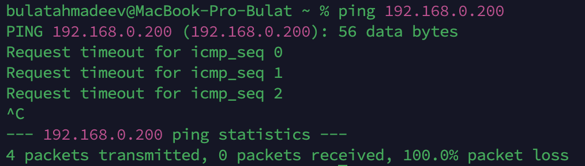
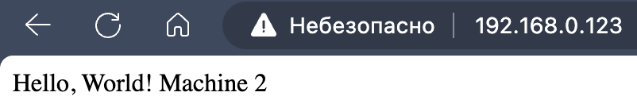
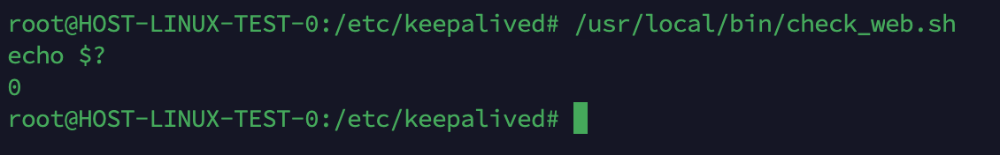
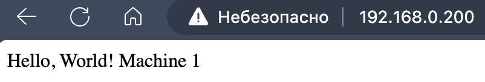
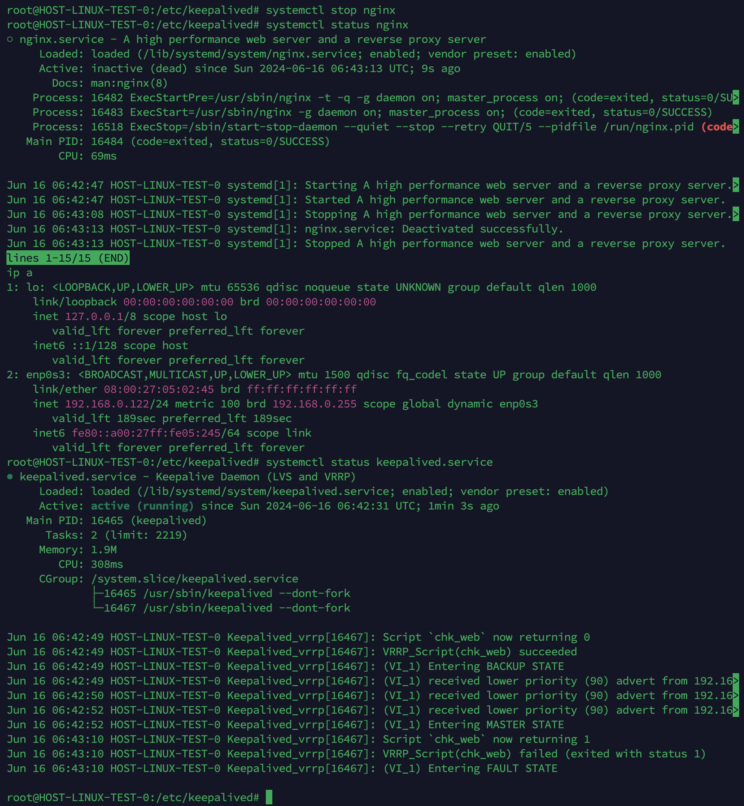
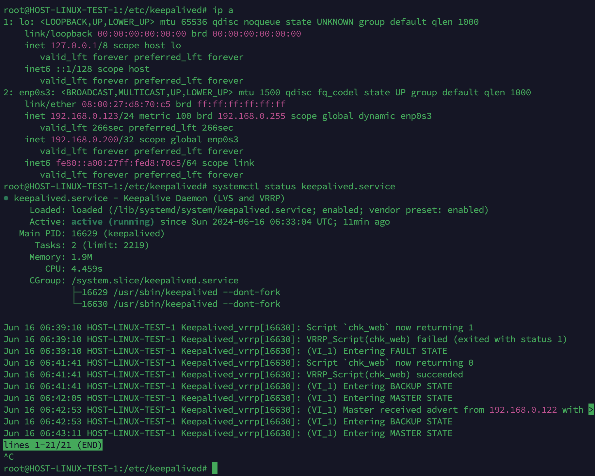

# Домашнее задание к занятию «Disaster recovery и Keepalived»

---
## Ахмадеев Булат Наилевич

---

## Задание 1

Смотреть файл: [text](hsrp_advanced.pkt)

---

## Задание 2

1. Установил keepalived командой: ```sudo apt install keepalived -y```

2. Узнал, что в моей сети нет хоста с ip-адресом ```192.169.0.200```:



Этот ip-адрес я буду использовать в качестве виртуального/плавающего ip-адреса.

3. Создал конфигурационные файлы на двух машинах:

Первая машина:

```                                            
global_defs {
    enable_script_security
}

vrrp_script chk_web {
    script "/etc/keepalived/check_web.sh"
    interval 3
    user root
}

vrrp_instance VI_1 {
    state MASTER
    interface enp0s3
    virtual_router_id 51
    priority 100
    advert_int 1

    virtual_ipaddress {
        192.168.0.200
    }

    track_script {
        chk_web
    }
}
```

Вторая машина:

```
global_defs {
    enable_script_security
}

vrrp_script chk_web {
    script "/etc/keepalived/check_web.sh"
    interval 3
    user root
}

vrrp_instance VI_1 {
    state BACKUP
    interface enp0s3
    virtual_router_id 51
    priority 90
    advert_int 1

    virtual_ipaddress {
        192.168.0.200
    }

    track_script {
        chk_web
    }
}
```

4. Установил nginx командой: ```sudo apt install nginx -y```

5. Добавил текст в index.html для определения:

Первая машина: ```echo "Hello, World! Machine 1" | sudo tee /var/www/html/index.html```


Вторая машина: ```echo "Hello, World! Machine 2" | sudo tee /var/www/html/index.html```



6. Создал файл для bash-скрипта: ```/etc/keepalived/check_web.sh```

```
#!/bin/bash

PORT=80
URL="http://localhost:$PORT/index.html"

# Проверка доступности порта
if ! nc -z localhost $PORT; then
    exit 1
fi

# Проверка наличия файла index.html
if ! curl -s --head --request GET $URL | grep "200 OK" > /dev/null; then
    exit 1
fi

exit 0
```

Сделал скрипт испольняемым: ```sudo chmod +x /etc/keepalived/check_web.sh```

Проверил работу скрипта:



Возвращает 0, значит все хорошо.

7. Перезапустил keepalived.

8. Проверка работы:

Захожу по адресу 192.168.0.200



Отключаю на первой машине службу nginx.



Видно, что виртуального интерфейса больше нет.

На второй машине виртуальный интерфейс появился, и служба keepalived уведомил, что перешел на статус MASTER.




---